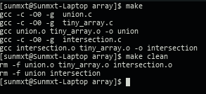

## TinyBuild

自用的支持自动推导 Makefile 实现。


由于不想每次新建一个小项目都需要重复编写 Makefile。所以写了这个通用的 Makefile模板。比较适合自己写一些小东西使用，可以节省不少时间。

这个 Makefile 可以根据定义的依赖关系自动推导所需要的文件。而且依赖规则定义的方式非常简单。

---

##### 简单的例子

假设需要编译出两个可执行文件： *union* 、*intersection*

*union* 依赖于 *union.c* *tiny_array.c*

intersection 依赖于 *intersection.c* *tiny_array.c*

只要在 Makefile 开头简单定义：

```makefile
BIN:=union intersection
BIN_union_C:=union tiny_array
BIN_intersection_C:=intersection tiny_array
```

Makefile 会自动推导出 clean 和 make all 的规则。具体的效果：

